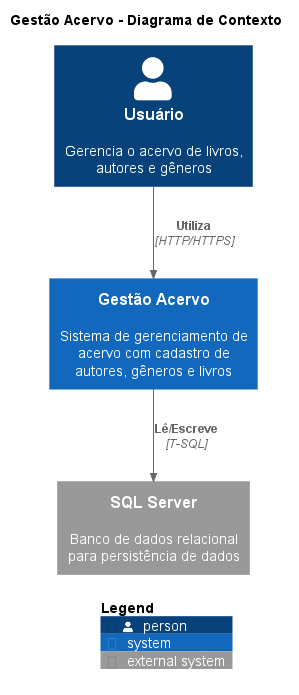

# Gestão Acervo Literário

> Sistema para consulta, cadastro e manutenção de gêneros, autores e livros.  
> Desafio Técnico — Siemens

---


[](./LICENSE)

---

## Índice

- [Sobre o Projeto](#sobre-o-projeto)
- [Arquitetura](#arquitetura)
- [Pré-requisitos](#pré-requisitos)
- [Execução com Docker (recomendado)](#execução-com-docker-recomendado)
- [Configuração e Execução — Backend (sem Docker)](#configuração-e-execução--backend-sem-docker)
- [Configuração e Execução — Frontend (sem Docker)](#configuração-e-execução--frontend-sem-docker)
- [Executando os Testes](#executando-os-testes)
- [Collections](#collections-para-teste-de-api)
- [Documentação da API](#documentação-da-api)
- [Estrutura do Repositório](#estrutura-do-repositório)
- [Bugs conhecidos](#bugs-conhecidos)
- [Licença](#licença)

---

## Sobre o Projeto

O **Gestão Acervo** é uma aplicação full-stack para gerenciamento de acervo bibliográfico, composta por:

- **Acervo.API** — API REST em .NET 8 (Minimal API) com versionamento de rotas, documentação Swagger e respostas padronizadas.
- **acervo-web** — SPA em Angular 17 com NgRx para gerenciamento de estado.

### Regras de Negócio Principais

- Um **Gênero** pode ter N livros; um **Autor** pode ter N livros.
- Cada **Livro** pertence a exatamente um Autor e um Gênero.
- **ISBN** e **e-mail do Autor** são únicos no sistema.
- Autores e Gêneros com livros vinculados **não podem ser excluídos**.

---

## Arquitetura

```
acervo-web  (Angular 17 + NgRx)
        │  HTTP/REST
Acervo.API  (.NET 8 Minimal API)
        │  EF Core
   SQL Server 2022
```

O backend segue **Clean Architecture** dividida em quatro projetos:

| Projeto                 | Responsabilidade                                                      |
| ----------------------- | --------------------------------------------------------------------- |
| `Acervo.Domain`         | Entidades, IRepository interfaces, Result pattern                     |
| `Acervo.Infrastructure` | DbContext, Repositories, Migrations                                   |
| `Acervo.Application`    | IService interfaces, Services, DTOs, ViewModels, Validators, Mappings |
| `Acervo.API`            | Endpoints (Minimal API), Configuração, AppSettings                    |
| `Acervo.Tests`          | Testes de Unidade (xUnit + Moq)                                       |

### Diagrama de Contexto



---

## Pré-requisitos

### Com Docker (recomendado)

| Ferramenta     | Versão mínima | Verificação              |
| -------------- | ------------- | ------------------------ |
| Docker Engine  | 24.x          | `docker --version`       |
| Docker Compose | 2.x (plugin)  | `docker compose version` |
| Git            | 2.x           | `git --version`          |

### Sem Docker (execução local)

| Ferramenta      | Versão mínima | Download                                 |
| --------------- | ------------- | ---------------------------------------- |
| .NET SDK        | 8.0           | https://dotnet.microsoft.com/download    |
| Node.js         | 18.x LTS      | https://nodejs.org                       |
| Angular CLI     | 17.x          | `npm install -g @angular/cli`            |
| SQL Server 2022 | 2022          | https://www.microsoft.com/sql-server     |
| EF Core CLI     | 8.x           | `dotnet tool install --global dotnet-ef` |

---

## Execução com Docker (recomendado)

A forma mais rápida de rodar o projeto completo — sem instalar .NET, Node ou SQL Server na máquina.

### 1. Clone o repositório

```bash
git clone https://github.com/<seu-usuario>/GestaoAcervo.git
cd gestaoacervo
```

### 2. Configure as variáveis de ambiente

```bash
cp .env.example .env
```

Edite o `.env` se quiser alterar a senha do SQL Server:

```env
SA_PASSWORD=Acervo@Dev2024!
```

> **Requisito:** mínimo 8 caracteres com letras maiúsculas, minúsculas, números e símbolo especial.

### 3. Suba toda a stack

```bash
docker compose up --build
```

O Compose irá automaticamente:

1. Subir o **SQL Server 2022** e aguardar o healthcheck passar
2. Subir a **Acervo.API** e aplicar as **EF Core Migrations** automaticamente
3. Subir o **Frontend Angular** via Nginx

### 4. Acesse os serviços

| Serviço       | URL                           |
| ------------- | ----------------------------- |
| 🌐 Frontend   | http://localhost:4200         |
| 🔌 API REST   | http://localhost:5000/api/v1  |
| 📖 Swagger UI | http://localhost:5000/swagger |
| 🗄️ SQL Server | `localhost,1433` / user: `sa` |

### Comandos úteis

```bash
# Rodar em background
docker compose up -d

# Ver logs em tempo real
docker compose logs -f

# Parar os containers (preserva dados)
docker compose stop

# Remover containers e apagar dados do banco
docker compose down -v
```

---

## Configuração e Execução — Backend (sem Docker)

### 1. Clone e acesse o diretório

```bash
git clone https://github.com/<seu-usuario>/GestaoAcervo.git
cd gestaoacervo/backend/Acervo.API
```

### 2. Configure a string de conexão

Edite `Acervo.API/appsettings.Development.json`:

```json
{
  "ConnectionStrings": {
    "DefaultConnection": "Server=localhost;Database=AcervoDB;User Id=sa;Password=SuaSenha;TrustServerCertificate=True;"
  }
}
```

### 3. Execute as Migrations

```bash
dotnet ef database update \
  --project Acervo.Infrastructure \
  --startup-project Acervo.API
```

### 4. Execute a API

```bash
cd Acervo.API
dotnet run --environment Development
```

Disponível em `http://localhost:5000` | Swagger: `http://localhost:5000/swagger`

---

## Configuração e Execução — Frontend (sem Docker)

```bash
cd gestao-acervo/frontend/acervo-web
npm install
ng serve
```

Disponível em `http://localhost:4200`

---

## Executando os Testes

### Backend (xUnit + Moq)

```bash
# A partir da raiz da solution
dotnet test

# Com relatório de cobertura
dotnet test --collect:"XPlat Code Coverage"
```

### Frontend (Jasmine + Karma)

```bash
cd frontend/acervo-web

# Execução única
ng test --watch=false

# Modo watch (desenvolvimento)
ng test
```

---

## Collections para teste de API

No diretório `./docs/collections` há uma collection em **JSON** para ser usada no Insomnia e outra para o Postman.

---

## Documentação da API

Com a API em execução, acesse o **Swagger UI**:

```
http://localhost:5000/swagger
```

### Endpoints disponíveis

| Recurso | Base URL          |
| ------- | ----------------- |
| Autores | `/api/v1/autores` |
| Gêneros | `/api/v1/generos` |
| Livros  | `/api/v1/livros`  |

### Exemplo de Request — Criar Livro

```http
POST /api/v1/livros
Content-Type: application/json

{
  "titulo": "Clean Code",
  "isbn": "9780132350884",
  "anoPublicacao": 2008,
  "autorId": "3fa85f64-5717-4562-b3fc-2c963f66afa6",
  "generoId": "7fa12c48-1234-4562-b3fc-9d874f22bcd1"
}
```

### Exemplo de Response — Sucesso

```json
{
  "success": true,
  "message": "Livro criado com sucesso.",
  "data": {
    "id": "a1b2c3d4-...",
    "titulo": "Clean Code",
    "isbn": "9780132350884",
    "anoPublicacao": 2008,
    "autorNome": "Robert C. Martin",
    "generoNome": "Tecnologia"
  }
}
```

### Exemplo de Response — Erro de Negócio

```json
{
  "success": false,
  "message": "Não foi possível concluir a operação.",
  "errors": ["ISBN '9780132350884' já está cadastrado no sistema."]
}
```

## Estrutura do Repositório

```
gestaoacervo/
├── docker-compose.yml           → Orquestração dos 3 containers
├── .env.example                 → Template de variáveis de ambiente
├── .gitignore
├── README.md
├── LICENSE
|
├── docs/
|   ├── collections/             → Collections para testar a aplicação
|
├── docker/
│   ├── backend/
│   │   ├── Dockerfile           → Multi-stage build da Acervo.API
│   │   └── .dockerignore
│   ├── frontend/
│   │   ├── Dockerfile           → Multi-stage build + Nginx
│   │   ├── nginx.conf           → Config Nginx para Angular Router
│   │   └── .dockerignore
│   └── sqlserver/
│       ├── init-db.sql          → Criação do banco AcervoDB
│       └── entrypoint.sh        → Script de inicialização do container
│
├── backend/
│   └── Acervo/                  → Solution .NET 8
├── frontend/
│   └── acervo-web/              → SPA Angular 17
```

---

## Bugs conhecidos

O arquivo entrypoint.sh (\docker\sqlserver\entrypoint.sh) pode ser baixado inadivertidamente com quebra de linha do Windows (CRFL, \r\n) e o shell do Linux (o que o Docker está usando) espera um arquivo com LF (Unix, \n). Como este arquivo é ponto de entrada para inicializar o SQL Server na virtualização ele pode travar a criação do container de banco de dados. Abra este arquivo no Visual Studio Code e mude-o de CRLF para LF se for o caso.

## Licença

Este repositório está sob a licença [MIT](./LICENSE)
